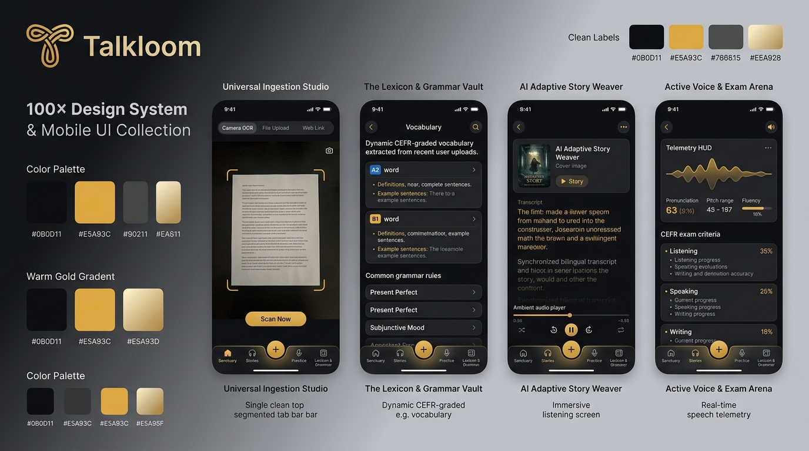
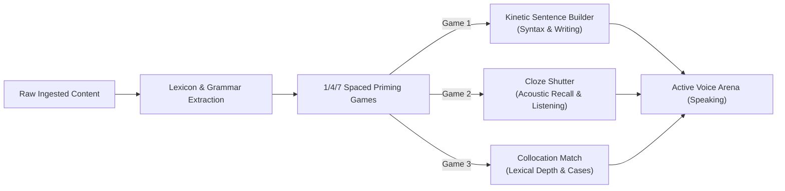

# 🎨 Talkloom: 100x Design System & UI Specification
> **Living Document for all UI/UX, Aesthetics, Motion, Layout, and Design Tokens.**  
> *Any future visual, layout, or interaction changes MUST be updated directly in this document.*

---

## 🖼️ System Visual Blueprint



---

## 1. Design Philosophy: "Editorial Precision Instrument"

Talkloom rejects both:
1. **The Cartoon Trap (Duolingo style):** Flat primary saturated hues, goofy 3D mascots, patronizing gamification.
2. **The Sterile AI Template Trap:** Generic dark-mode slate/zinc, centered glass cards with neon purple/blue gradients, robotic labels.

**The Talkloom Vision:**  
An **audio-first linguistic precision instrument** blending the craftsmanship of **high-end acoustic hardware (Leica, Braun, Teenage Engineering)** with the typographic elegance of an **international editorial broadsheet (The New Yorker, Monocle)**.

---

## 2. Color Tokens & Materials

### Palette Matrix
| Token | Hex | Role | Usage |
| :--- | :--- | :--- | :--- |
| `AppColors.obsidian` | `#0B0D11` | Primary Canvas | App-wide dark background with 2% analog film grain. |
| `AppColors.surfaceElevated` | `#14171F` | Elevated Surface | Base card and container surface. |
| `AppColors.frostedGlass` | `rgba(20, 23, 31, 0.65)` | Translucent Glass | Navigation bar, floating HUD pills, modal sheets (`blur(24px)`). |
| `AppColors.brassGold` | `#E5A93C` | Hero Signature Accent | Brand logo, primary CTA buttons, active state glows, mastery highlights. |
| `AppColors.brassGoldLight` | `#F3C766` | Secondary Accent | Audio waveform crests, hover states, sub-badges. |
| `AppColors.borderSpecular` | `rgba(255, 255, 255, 0.12)` | Hairline Highlight | Top-lit edge of beveled cards fading to `rgba(255, 255, 255, 0.02)`. |
| `AppColors.textPrimary` | `#F5F5F3` | Primary Ink | Headlines, lesson content, primary labels. |
| `AppColors.textMuted` | `#8A8F9E` | Secondary Ink | Metadata, timestamps, inactive icons. |
| `AppColors.emeraldActive` | `#10B981` | Success / Spontaneous | Recognized vocabulary, passed exam criteria, active mastery node. |

---

## 3. Typographic Hierarchy & Tension

| Role | Font Family | Style / Weight | Usage |
| :--- | :--- | :--- | :--- |
| **Editorial / Cultural** | *Cormorant Garamond* or *Newsreader* | Serif, Light to SemiBold, Optical Sizes | Story text, cultural excerpts, foreign phrases, chapter titles. |
| **Telemetry / HUD** | *Geist Mono* or *JetBrains Mono* | Monospace, Medium, Tabular Numbers | Latency counters (`180ms`), cognitive load gauges, CEFR ratings, timestamps. |
| **System UI** | *Inter* or *Plus Jakarta Sans* | Clean Sans-Serif, Regular / Medium | Buttons, tab bars, navigation labels, settings. |

---

## 4. Unified Navigation Architecture (The 5-Tab Bar)

The bottom navigation bar is **consistent across every primary screen**, rendered in frosted obsidian glass with a top specular hairline:

```
┌──────────────────────────────────────────────────────────────────────────┐
│   [ 🏛️ Sanctuary ]   [ 🎧 Stories ]   ( ➕ Ingest )   [ 🎙️ Arena ]   [ 📖 Vault ]  │
└──────────────────────────────────────────────────────────────────────────┘
```

1. **Tab 1 — The Sanctuary (Home & Review):**
   * Daily linguistic cadence dashboard.
   * 1/4/7 Spaced repetition recall queue (Ebbinghaus review deck).
   * Active vocabulary mastery constellation graph.

2. **Tab 2 — AI Adaptive Story Weaver (Listening & Reading Immersion):**
   * Generates continuous narrative chapters dynamically incorporating user-acquired vocabulary ($\ge 15$ lemmas) and grammar concepts.
   * Synchronized bilingual transcript with word-by-word playback highlights.
   * Studio voice synthesis with realistic breathing and emotional intonation.
   * End-of-chapter *Hörverstehen* (listening comprehension) checkpoints.

3. **Center Button — Universal Ingestion Studio (`+` Gold Pill):**
   * Elevated warm brass gold action pill.
   * Slides open the Ingestion Studio with a single, clean top segmented tab bar:
     * `[ 📷 Camera OCR ]` : Viewfinder with thin gold alignment brackets & instant OCR.
     * `[ 📄 File Upload ]` : Frosted drag-and-drop dropzone for PDFs, contracts, and images.
     * `[ 🔗 Web Link ]` : URL input with auto-clipboard detection for YouTube videos and articles.

4. **Tab 3 — Active Voice & Exam Arena (Speaking & HUD):**
   * Real-time conversation with the pedagogical voice agent.
   * **Pilot HUD Telemetry:** Real-time speech latency, pitch variance, and cognitive load indicators.
   * **CEFR Standard Scorecard:** Real-time grading across official exam rubrics (**Listening, Speaking, Writing**).
   * **Spontaneous Production Trigger:** Visual gold pill pulses when a learner naturally produces an active vocabulary lemma.

5. **Tab 4 — The Lexicon & Grammar Vault:**
   * Dynamic CEFR-graded dictionary extracted from all user uploads.
   * Detailed lemma inspector: gender (`der/die/das`), IPA phonetics, and contextual sentence from the original source.
   * Grammar rule cards extracted from context (e.g. *Subjunctive II*, *Wechselpräpositionen*).

---

## 5. Pedagogical Mini-Games (1/4/7 Spaced Priming)

Before transitioning to live voice conversation, learners prime their passive-to-active syntax through 3 tactile mini-games:



1. **The Kinetic Sentence Builder (Writing & Syntax):**
   * **Cognitive Target:** Overcoming word order anxiety (e.g. German subordinate clauses verb-final rule).
   * **Tactile Design:** Words float as magnetic glass tiles. Dragging features physical inertia, snapping cleanly into sentence slots. Misplaced tiles trigger an elastic rebound.
2. **The Cloze Shutter (Listening & Rapid Recall):**
   * **Cognitive Target:** Immediate phonetic and grammatical gap identification.
   * **Tactile Design:** Audio snippet plays from an authentic source. Right at the key preposition or inflection, the audio mutes with a 5-second closing shutter disc.
3. **Collocation Match (Lexical Depth):**
   * **Cognitive Target:** Eliminating preposition translation errors (e.g. *warten auf + Akk* vs *depend on*).
   * **Tactile Design:** Rapid pairing of verbs with their required prepositions and cases against a timer.

---

## 6. Micro-Interactions, Animation & Physics Rules

* **Easing Curve:** Use standard Apple fluid springs: `cubic-bezier(0.16, 1, 0.3, 1)` for sheet transitions; physics spring (`stiffness: 300, damping: 24`) for tile interactions.
* **Liquid Glass Specular Borders:** Never use flat solid borders. All elevated containers must use a 1px directional linear gradient border (`top: rgba(255,255,255,0.14)` to `bottom: rgba(255,255,255,0.02)`).
* **Audio Visualizer:** Never use static equalizers. Use a continuous, math-driven Lissajous curve or multi-octave Perlin noise wave that reacts to real speech volume and pitch dynamics.

---

*Note: Update this document whenever a screen layout, color code, or UI element is added or changed.*
